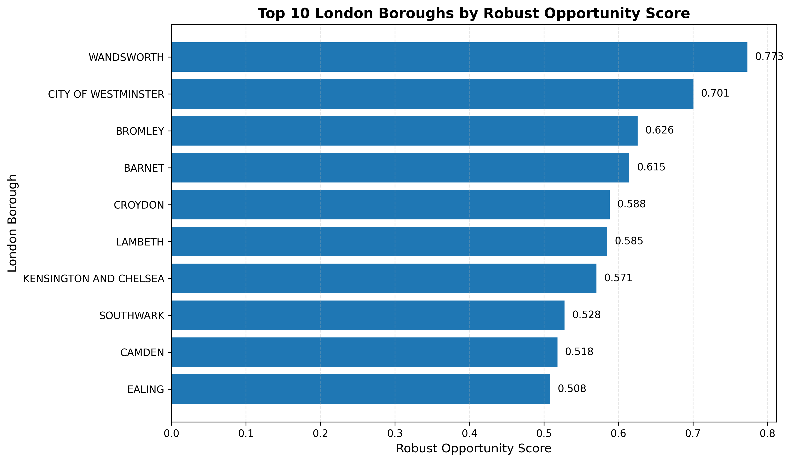

# London Property Intelligence

## Portfolio Project

### Project Overview

London Property Intelligence is a data science project that analyzes residential property transactions across London's 33 administrative areas using HM Land Registry data.

The project explores market activity, property values, and investment opportunities through exploratory data analysis (EDA), feature engineering, business-driven scoring models, and data visualization.

Rather than focusing only on descriptive statistics, the analysis develops custom scoring methods to evaluate London boroughs from different investment perspectives and demonstrates how data can support real-world decision-making.

---

## Business Problem

Property investors often face a trade-off between expensive premium locations and highly active housing markets.

High property values may indicate prestigious locations, while high transaction activity may reflect stronger market liquidity and demand. Considering only one of these factors may lead to incomplete investment decisions.

This project investigates whether combining market activity and property values can provide a more balanced view of investment opportunities across London boroughs through a transparent, data-driven scoring approach.

## Dataset

The analysis uses the HM Land Registry Price Paid Data (PPD), an official UK government dataset containing residential property transaction records across England and Wales.

For this project, the dataset was filtered to include only transactions within Greater London, resulting in a borough-level analysis covering London's 33 administrative areas.

### Data Source

- HM Land Registry – Price Paid Data (PPD)
- Residential property transactions within Greater London
- Coverage: 2018–2025

### Key Variables Used

- Property sale price
- Transaction date
- London borough (District)
- County

## Project Workflow

The project follows a structured data science workflow, transforming raw property transaction data into business-oriented market insights.

```text
HM Land Registry Price Paid Data (2025)
                │
                ▼
Filter Greater London Transactions
                │
                ▼
Explore Borough Activity & Average Property Prices
                │
                ▼
Engineer Investment Features
(Log Price Transformation & Scaling)
                │
                ▼
Build Market Opportunity Score
                │
                ▼
Evaluate Alternative Weighting Scenarios
                │
                ▼
Create Robust Opportunity Score
                │
                ▼
Generate Business Insights
```

## Skills Demonstrated

This project demonstrates practical data science techniques and business analytics skills, including:

- Data cleaning and preprocessing
- Exploratory Data Analysis (EDA)
- Feature engineering
- Feature transformation and scaling
- Business-driven scoring model design
- Sensitivity analysis
- Data visualization
- Business insight communication

## Key Results

The analysis produced several key findings:

- Wandsworth achieved the highest Robust Opportunity Score, demonstrating a strong balance between market activity and property value.
- City of Westminster ranked highly due to its premium property prices despite lower transaction activity.
- Market rankings changed under different weighting scenarios, showing that investment opportunities depend on investor priorities.
- Applying a log transformation reduced the influence of extreme property prices and produced a more balanced scoring model.
- The Robust Opportunity Score identified boroughs that consistently performed well across multiple investment scenarios.

### Robust Opportunity Score

The Robust Opportunity Score combines multiple investment scenarios to identify London boroughs that consistently demonstrate strong investment potential. Unlike individual scoring methods, this composite score provides a more balanced and stable assessment of market opportunities.

<p align="center">
  
</p>

*Figure 1. Top 10 London boroughs ranked by the Robust Opportunity Score.*

## Repository Structure

```text
London-Property-Intelligence/
│
├── data/
│   ├── raw/
│   └── processed/
│       └── london_transactions.csv
│
├── docs/
│
├── notebooks/
│   ├── 01_Exploring_HM_Land_Registry.ipynb
│   ├── 02_Build_Multi_Layer_London_Dataset.ipynb
│   ├── 03_Build_Borough_Dataset.ipynb
│   └── 04_Model_Development.ipynb
│
├── reports/
│
├── src/
│
├── visuals/
│
├── .gitignore
├── LICENSE
├── README.md
└── requirements.txt
```

## How to Run

1. Clone this repository.
2. Open the project in Visual Studio Code or Jupyter Notebook.
3. Install the project dependencies:

```bash
pip install -r requirements.txt
```

4. Open the notebook located in the `notebooks` directory.
5. Run the notebook cells sequentially to reproduce the analysis.

## Future Development

Planned future improvements include:

- Integrating additional London open datasets
- Developing predictive machine learning models
- Building an interactive Streamlit dashboard
- Expanding the investment scoring framework
- Deploying the project as a portfolio application

------------------

# Version 2 – Predictive Modelling

## Objective

The objective of Version 2 was to evaluate whether historical borough-level market statistics could be used to predict average house price growth in the following year.

Rather than focusing solely on predictive performance, this stage investigates whether the currently available HM Land Registry features contain sufficient information to support reliable forecasting.

## Models Evaluated

The following models were implemented and compared:

- Baseline Model
- Linear Regression
- Random Forest
- Random Forest (without City of London)
- XGBoost

## Model Performance Summary

Model performance was evaluated using Mean Absolute Error (MAE), Root Mean Squared Error (RMSE), and the coefficient of determination (R²). The baseline model was used as the reference benchmark to assess whether more sophisticated machine learning models provided meaningful improvements.

| Model | MAE ↓ | RMSE ↓ | R² ↑ | Key Observation |
|-------|------:|-------:|------:|----------------|
| **Baseline** | **0.0773** | 0.1120 | -0.2289 | Benchmark model with the lowest MAE |
| Linear Regression | 0.0987 | 0.1499 | -1.2013 | Linear relationships were insufficient for accurate prediction |
| Random Forest | 0.1040 | 0.1513 | -1.2426 | Greater model complexity did not improve performance |
| **Random Forest (without City of London)** | 0.0792 | **0.1020** | **-0.1986** | Best RMSE and R² after removing an influential outlier |
| XGBoost | 0.1100 | 0.1772 | -2.0778 | Gradient boosting did not outperform the baseline |

### Interpretation of Results

The predictive modelling results show that increasing model complexity did not lead to meaningful improvements in forecasting next-year borough-level house price growth. Although Random Forest showed a slight improvement after removing the City of London from the analysis, none of the evaluated machine learning models consistently outperformed the baseline model.

These findings suggest that the main limitation lies in the information available within the current feature set rather than in the choice of algorithm. In other words, more sophisticated models alone cannot compensate for a lack of predictive features.

This outcome reflects an important principle in data science: building better predictive models often requires better data, richer features, and deeper domain knowledge—not simply more complex algorithms.

## Key Findings

None of the evaluated machine learning models outperformed the baseline model.

More complex algorithms, including Random Forest and XGBoost, did not produce better predictions than the simpler baseline approach.

A sensitivity analysis was also conducted by removing the City of London, which had previously shown unusually large annual price fluctuations. Although model performance improved slightly, the overall conclusions remained unchanged.

## Conclusion

The results suggest that the current feature set does not contain enough predictive information to model next-year house price growth reliably.

This indicates that the main limitation lies in the available features rather than in the choice of machine learning algorithm.

These findings motivate the next stage of the project, which will focus on feature engineering and the integration of additional external datasets.

## Project Evolution

- **Version 1** – Exploratory Data Analysis, feature engineering and business scoring.
- **Version 2** – Predictive modelling using Linear Regression, Random Forest and XGBoost.
- **Version 3 (Current)** – Building a multi-layer London Intelligence Dataset by integrating external urban datasets to improve feature engineering and support more informative predictive modelling.

Version 3 focuses on enriching the borough-year property dataset by integrating external urban intelligence datasets.

Completed

- ✅ Population Layer (ONS Mid-Year Population Estimates)

Planned

- Crime Layer
- Income Layer
- Public Transport Accessibility Level (PTAL)
- Index of Multiple Deprivation (IMD)

The resulting London Intelligence Dataset will provide richer explanatory variables for investment analysis and future predictive modelling.

## Author

Shiva

Data Science Portfolio Project

## ## Data Availability

The original HM Land Registry Price Paid dataset is not included in this repository because of its large file size.

The processed datasets used throughout this project are available in:

* `data/processed/london_transactions.csv` — Cleaned property transaction dataset used for exploratory analysis and feature engineering.
* `data/processed/london_intelligence_dataset.csv` — The current multi-layer analytical dataset, created by integrating the borough-year property dataset with external urban intelligence layers. At this stage, the dataset includes the ONS Population layer.

The original HM Land Registry dataset can be downloaded from the official HM Land Registry website.

## License

This project is released under the MIT License.

See the `LICENSE` file for details.